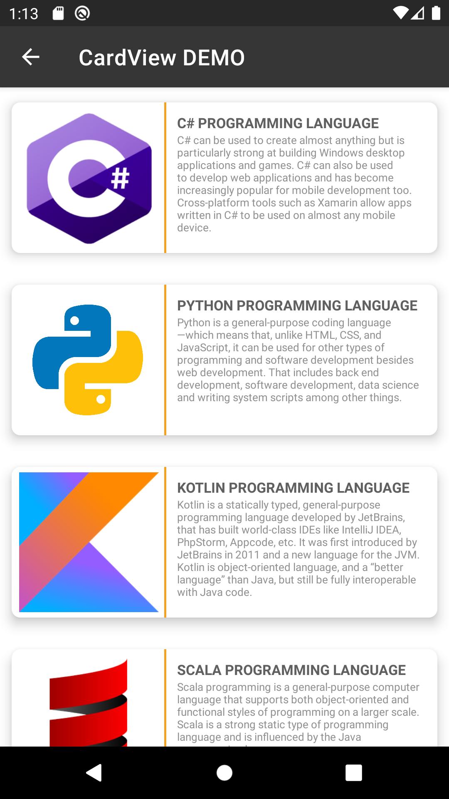

# CardViewList

This is an android Application written in Kotlin language. It's a Basic custom ListView.
Developed for ISE308

## Plagiarism Warning:

If you are in higher education please read "plagiarism.txt" and your University's codes of conduct and other applicable / related documents regarding plagiarism and academic dishonesty.

# Screenshot From Application

